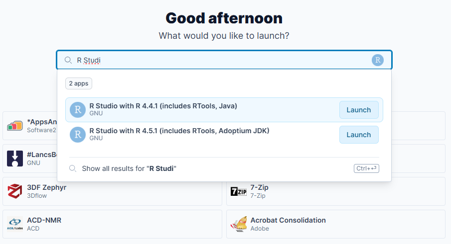
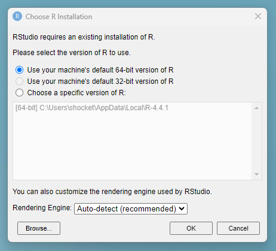
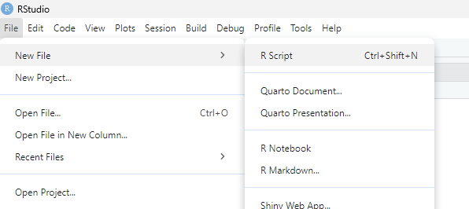
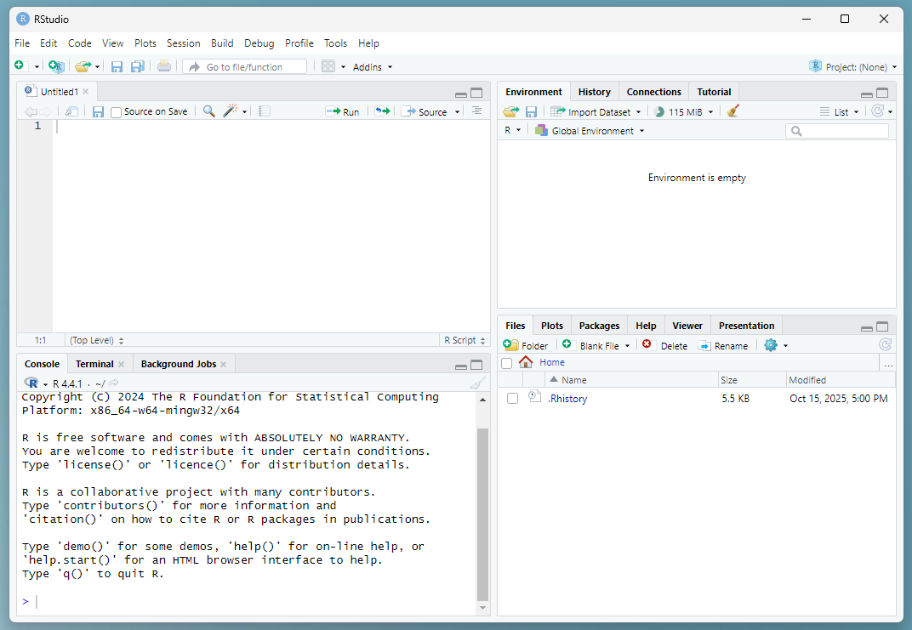
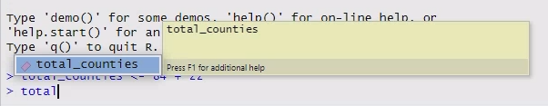
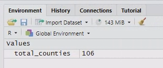
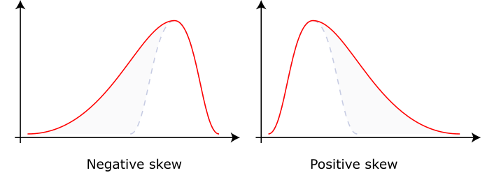

# (PART) Week 1 {-}

# Accessing R and RStudio through AppsAnywhere

This week we will be using AppsAnywhere to access RStudio (which automatically includes R). Follow the steps below.

Use the Windows menu to open "AppsAnywhere".

Within AppsAnywhere, search for "R Studio" and launch the option with R 4.4.1.

::: {.rmdwarning}
***Warning!*** Although in most places RStudio is written as one word, in AppsAnywhere you must search for it as two words.
:::

::: {.rmdwarning}
***Warning!*** You must select the option with R version 4.4.1 - the option with version 4.5.1 does not currently work.
:::

<div style="text-align: center;">

{width=100%}

</div>

Choose your R installation - select the default 64-bit version of R. You should only have to do this step the first time that you use a given computer.

<div style="text-align: center;">



</div>

RStudio should launch automatically when you click "OK".

# The RStudio interface

RStudio should now be open.

Before we do anything else, click on File > New File > R Script to create a new R script. This should open up a new panel in your window.

<div style="text-align: center;">



</div>

Now the RStudio window shoudl be divided into four quadrants:

- *Top left*: Code files - where you can see and edit your saved code files (called "**scripts**"), including this R markdown document. Some types of data can also be viewed here.
- *Bottom left*: `Console` - where you can input commands and see code that has been run. This is also where text-based output gets printed if you are using a regular R script instead of an R markdown file.
- *Top right*: `Environment` - where you can see the saved data objects in your current R workspace.
- *Bottom right*: This has several useful tabs: `Files` - which we've already been using; `Help` - where you can look up documentation about specific commands; and `Plots` - where images appear if you are using a regular R script instead of an R markdown file. (Ours will appear inside the code file instead.)

Most of the time when work you in R, you'll type your code into a script file. 

<div style="text-align: center;">

{width=100%}

</div>
::: {.rmdwarning}
***Warning!*** Although you can run code from both the script pane (top left) and console pane (bottom left), there is a big difference between them!!!

- If you type something into the script pane you can run it multiple times and save it for future use.
- If you type something into the console pane, it will run once and then disappear.

So make sure that you are typing your code into the right location!

This will almost always be a script file, not the console.
:::


# The grammar of coding

## Introduction to Coding in R

To help us talk about coding, we need to learn some vocabulary. Five essential building blocks of any coding language are:

1. Operators
2. Variables
3. Functions
4. Arguments
5. Comments

We'll learn about each of them and practice typing some code into the Console and running it from there.

## Operators

**Operators** are typically 1 or 2-character commands that correspond to very simple, common tasks.

For instance, all of the basic mathematical symbols are operators in most programming languages, e.g., `+` (addition), `-` (subtraction), `*` (multiplication), and `/` (division).  In R, exponents can be expressed with either the caret, `^`, or a double asterisk, `**`.

Thus, like Excel, R can function as a basic calculator. 

Type `84 + 22` directly into the Console (bottom left quadrant, labeled "Console") and hit Enter.

```{r}
84 + 22
```

## Variables / Objects

Data can be saved as named **variables**, which allows you to refer to and use them later. In R these are usually called objects since the word "variable" is frequently used in the statistical sense instead. You can think of variables as analogous to nouns.

- In R, we use the arrow operator `<-` to save objects.
- We can save the output from our command above using the following code: `total_counties <- 84 + 22`.
- Then whenever we use the object `total_counties`, R will substitute the value `106`.

Create and store an object by typing `total_counties <- 84 + 22` into the Console and hit Enter. Now type `total_counties` and hit Enter.

```{r}
total_counties <- 84 + 22
total_counties
```

::: {.rmdtip}
**Tip:** As you type, RStudio will suggest objects that are stored in your environment that start with the same characters.

You can either:

- click on them
- Use the arrow keys + Enter to select them.

This will save you time and also prevent typos from causing bugs!
:::

<div style="text-align: center;">



</div>

Now you should be able to see the `total_counties` object in your `Environment` panel.

<div style="text-align: center;">



</div>

## Functions

**Functions** are the commands that tell the program to do something. You can think of them as the verbs of a programming language. Functions are always followed by a set of brackets.

For example, the function `getwd()` will provide your current _working directory_ (the location where R will read and save files).

Type the function `getwd()` into the Console and hit Enter. (Your output will look different than mine, because I'm using a different computer.)

```{r}
getwd()
```

::: {.rmdtip}
**Info:** As you type the command `getwd()`, RStudio will automatically add the ending bracket when you type the starting bracket. (You will see later that it also does the same thing with quotation marks.)

This helps avoid introducing bugs from forgetting to close your brackets.
:::

## Arguments

Most functions also take inputs called **arguments** that go inside the parentheses. Arguments are generally either:

1) Data to process
2) Settings that tell the function how to process the data

For example, the function `sqrt(x)` takes one argument, `x`, and calculates its square root.

Type `sqrt(4)` into the Console and hit Enter.

```{r}
sqrt(4)
```

One operator that can be useful for getting arguments into functions in R is the **pipe** operator: `|>`

The pipe operator passes data to the first argument of the next function. (You'll see why this is useful later.)

For now, type `9 |> sqrt()` into the Console and hit Enter.

```{r}
9 |> sqrt()
```

## Comments

**Comments** are another critical part of coding, although not part of the code itself. Comments explain what the code is doing, and are a crucial part of making your code understandable to both other people and to yourself. (Every programmer hates the feeling of going back to old code days/weeks/months/years after you first wrote it and thinking "What the #$&! was I doing here????" Commenting your code properly makes your life much easier.)

* In R, comments are preceded by the hash symbol `#`.
* The `#` symbol tells R to ignore whatever else follows on that line in the script (i.e. not interpret it as code).

Type the statement `# Hello world!` into the Console and hit Enter.

There will be no output - because you've told R to ignore your input.

```{r}
#hello world!
```


# Running code from a script

Now that you've run some basic code via the `Console`, we're going to learn how to do it from a script file.

Almost all of the time that you are running code, you will do it from a script.

::: {.rmdtip}
**Info:** Running code from a *script file*, instead of from the Console, has several benefits:

- Everything you've done is clearly documented.
- You can re-run any part of your code if needed.
- You can save your code to refer to or repeat again later.
- Your analysis can be easily shared with and repeated by someone else.

These are some of the core reasons for using a coding-based statistics tool - it makes your analyses **transparent and reproducible**. 
:::

## Two methods for running code

There are two methods to run bits of code from a script.

1. Press `Ctrl + Enter` 
2. Click the `Run` button with the green arrow near the top right of the script panel

For both methods, you can either move your cursor to a specific line of code to run just that line, or highlight a larger portion of code to run the whole selection.

You can also run an entire script using the `source` button with the blue arrow to the right of the `Run` button.

Type the following code into your R script file. Run the code using all three methods.

- First practice running each line separately, and watch what happens in the console after each command.
- Then try running all the lines at once, using highlighting and using the `source` button.

(Note: I've turned off the results in the code chunk below, so all you can see is the code itself.)

```{r eval=FALSE}
# Random practice code
a <- 3
b <- 5
a + b
a^2
b * a
b**a
1:5
y <- c(1, 2, 3, 4, 5)
y + y
y * 2
z <- b/a
z
z <- "Lancaster"
z
```

::: {.rmdtip}
***Tips!***

Two important bits of R syntax (syntax = rules for how a language works):

- The colon operator tells R to list out every integer number between A and B, when written as `A:B`.
- The small letter `c` (short for the term "concatenate") is used to group data together into a larger object called a **vector**.

You can think of a vector like a list of data (although the word list actually specifically refers to a specific type of data object in R that we aren't using).

We'll use both of these operations in later practical work.
:::

::: {.rmdtip}
***Tip!***

Note that you can perform calculations on a vector. However, all parts of the calculation must either be the same length, or be multiples of each other so that the smaller vector can be repeated evenly. (A single number can always be repeated any number of times.)

- In the first example (`y + y`), the vectors `y` and `y` are both the same length (5).
- In the second example (`y * 2`), the number 2 is repeated 5 times to match the length of the vector `y`.
:::

::: {.rmdquestion}
**Q:** What happens to the variable `z` when you run the second-to-last line of code? Why might that be a problem?
:::


# Fixing common mistakes

## Error messages

Being able to interpret error messages to fix your mistakes is an important part of coding.

The red text may seem scary, but usually it will contain a good clue to help you with debugging your code. 

Type the following bits of code into the Console and see if you can figure out what the problem is for each of the very common mistakes below based on the error message.

```r
sqrt()
```

```r
Lancaster + 5
```

```
"Lancaster" + 5 
```

::: {.rmdtip}
**Tip:** If you want to make something character-type data, put it in quotation marks. Otherwise R will assume that it is referring to a saved variable.
:::

## Why am I seeing plus signs?

If you give R instructions (in the form of code), R will wait until it thinks the instructions are complete before it allows you to do anything else.

Sometimes errors in your code (often an unmatched bracket) will mean that you think you have written a complete set of instructions, but R is still waiting for more (e.g. a closing bracket).

When this happens, you will see `+` in the Console instead of `>`. This indicates that R thinks that there's still more code to come.

::: {.rmdtip}
**Tip:** If R gets stuck in unfinished code and the Console has `+` at the start of the line, hit `Esc` to exit the current task.
:::

Practice getting stuck with R waiting for more code and then using `Esc` to get out of it by running the incomplete function below.

```r
sqrt(
```

# Installing and loading packages

Before we can continue, we will need to install and load some packages.

A package is a set of extra functions that are not part of the basic R installation but can be added on later. You can think of them like apps that enhance R.

Today we will be using two packages:

- `psych` - a package for exploring data and generating a specific set of descriptive statistics
- `tidyverse` - a collection of related packages for 'wrangling' (i.e., manipulating) data and plotting figures. Within the tidyverse, the main packages we will be using are `dplyr` (data manipulation) and `ggplot2` (plotting).

For tidyverse packages, you can load the specific packages that you want individually, or all together as the `tidyverse` package. We'll do the latter since it will require fewer lines of code.

::: {.rmdwarning}
**Warning:** You only need to install a package once on a given computer. However, you need to load it every new R session.
:::

## Directions to install packages

1. Click on the Packages tab in the bottom right quadrant, and then click on the Install button at the top left of the panel. **OR** Click on 'Tools' in the top menu, and then click on the first option 'Install Packages...' (Both options will bring up the same window.)

2. Type the name of the first package that we want (`psych`) into the 'Packages' blank. A menu with autocomplete suggestions will populate as you type, and you can either click or press the arrow keys and hit 'Enter' to select the one you want. 

3. Hit 'Install'. In general, this takes anywhere from a few seconds to a few minutes, depending on the sizes of the package(s) you select.

> As the package installs, you will see a lot of text printing in the Console. There will often be some warning messages about certain functions being masked. Don't worry about all of that, you can just ignore them. <br> If you get a pop-up window asking something about binary code, just click 'Okay'.

4. Now do the same thing (steps 2 & 3) with the `tidyverse` package.

## Loading packages

Now that you've had practice running code running code from a script, run the following code to load the two packages you installed earlier.

Generally, you load packages using the `library()` function.

Type and run the code below. There will be some output in the Console that you can ignore.

```{r, eval = FALSE}
library(tidyverse)
library(psych)
```


# Data frames

In order to work with data in R you do need...well...data.

For this practical, we are going to work with two built-in datasets, starting with one called `iris`.

::: {.rmdtip}
**Info:** The `iris` dataset was originally collected by the botanist [Edgar Anderson](https://en.wikipedia.org/wiki/Edgar_Anderson) and made famous by [Ronald Fisher](https://en.wikipedia.org/wiki/Ronald_Fisher).

It consists of data on the morphological variation between three different species of iris, specifically *Iris setosa*, *Iris virginica*, and *Iris versicolor*. It is a classic dataset in the fields of statistics and machine-learning.
:::

To load the dataset, add a few blanks lines, and then write the following code and run it (*Note: this particular approach only works for the built-in datasets*).

This code takes a hidden object (the built-in dataset called `iris`) and saves it as a normal object that we can see called `irisdata`.

```{r}
irisdata <- iris
```

## Examining data frames

R loads data as a specific type of object called a **data frame** that has observations (rows) of variables (columns). Each column has a name and the rows are numbered sequentially.

::: {.rmdquestion}
**Q:** Look at the `Environment` tab. How many observations and variables does the iris data frame have?
:::

Click on the blue circle just to the left of the data frame in the `Environment` tab. It should drop down a preview of all the variables and their first few values.

Click on the name `irisdata`. It should open a table in your scripts panel. Scroll down to examine the full table.

You can also examine data frames in R using the `head()`, `tail()` and `View()` functions.

```{r, eval=FALSE}
head(irisdata)
tail(irisdata)
View(irisdata)
```

::: {.rmdquestion}
**Q:** What do each of these functions do?
:::

## Referring to columns in a data frame

To refer to a specific variable (column) in a data frame, you can use the `$` symbol.

Type the following code into your R script and run it. Practice using the autocomplete feature to select the data frame and the variable name.

```r
irisdata$Petal.Length
```

::: {.rmdquestion}
**Q:** What happens? Why might this be useful as you are coding?
:::

## Calculations using a column in a data frame

Just like with vectors, you can easily and quickly perform calculations on entire data frame columns in R.

For example, if you want to measure the ratio of petal length to petal width for all of the flowers, you could do the following:

Type and run the following code.

```{r}
irisdata$Petal.Length / irisdata$Petal.Width
```

The code above prints the ratios in the Console.

If you want to save your calculation as a new column instead, all you have to do is save it with the assignment operator ( `<-`). If you assign it to an existing name, you will overwrite the old column with the new calculation. If you use a new name, you will create a new column instead.

Modify your code as shown below to create a new column.

::: {.rmdtip}
**Tip:** Look at your the environment tab before and after you run the code - watch to see the number of columns in your data frame increase.
:::

```{r}
irisdata$Petal.aspectratio <- irisdata$Petal.Length / irisdata$Petal.Width
```

# Basic summary statistics and getting help

Now we'll perform some simple calculations using the iris data.

Let's calculate the mean ($\bar{x}$) and standard error ($\mathrm{SE}$) of the estimates of petal length.

The formula for the standard error of something that you've observed directly uses the standard deviation ($\sigma$) and the number of data points ($n$):

$$\mathrm{SE} = \frac{\sigma}{\sqrt{n}}$$

For calculating the square root, you can either use the `sqrt()` function or an exponent of 0.5 using the `^` symbol (they are mathematically equivalent).

The R functions you'll use for the calculations today are:

- mean: `mean()`
- standard deviation: `sd()`
- square root: `sqrt()`
- length of a vector = number of data points: `length()`

Type the code below into your R script and run it. Remember to use the auto-complete feature again!

Note that you can nest functions inside of other functions, like with `sqrt()` and `length()` below!

```r
# Basic calculations
mean(irisdata$Petal.Length)
sd(irisdata$Petal.Length)
length(irisdata$Petal.Length)
sd(irisdata$Petal.Length) / sqrt(length(irisdata$Petal.Length))
```

::: {.rmdquestion}
**Q:** Is this what you expected? How would you expect to find these same statistics about petal width instead?
:::

## Help and documentation

Sometimes a function is not working and you can't immediately see why. Luckily R stores documentation for (nearly) all its functions directly for you to refer to!

Type the following code into your R **console** and run it. 

```r
?sd
```

This should bring up a help page that outlines the function, what it does, and how to use it.

It also lists what arguments a function expects and what to put in them.

You can also search for functions in the Help tab's search bar.

Search for `mean` and skim the documentation quickly.

::: {.rmdtip}
**Tip:** Within this website, you'll see that some function names are automatically converted to links e.g. `mean()`. You can click on these and it will take you to a web version of the internal help page for that function!
:::

# Numerical data exploration

```{r include=FALSE}
# Re-init environment
library(psych)
irisdata <- iris
```

We were able to calculate the mean and standard error for some of our data, but there are some functions that are designed to help us explore our data and get those measurements more easily.

## `summary()`

Base R has a function called `summary()` that you can use on a lot of different types of objects.

If you use it on a data frame, it will print the following values for each numeric variable:

- Minimum
- 1st quartile (25% percentile value)
- Median (50% percentile value)
- Mean
- 3rd quartile (75% percentile value)
- Maximum
- Number of NAs (if applicable)

Type the following code into your R script and run it:

```{r}
# Basic descriptive statistics
summary(irisdata)
```

::: {.rmdquestion}
**Q:** What information does it provide for non-numeric variables like species?
:::

## `describe()`

The `psych` package has a function called `describe()` that provides a larger and slightly different set of statistics. Most of these should already be familiar to you:

- count of observations ($n$)
- mean
- standard deviation (sd)
- median
- minimum (min)
- maximum (max)
- range
- standard error (se)

However, some may be less familiar (see below).

Type the code below into your R script and run it:

```{r}
describe(irisdata, omit = TRUE, IQR = TRUE)
```

Here, we are providing the required data frame and two optional keyword arguments to change the settings. Optional arguments can be written in any order (after the required arguments) and use the keyword followed by `=` to tell the function which specific setting the input belongs to.

(We could also write out `describe(x = data_area)` if we wanted, but instead we are taking advantage of R's defaults for handling required arguments.) 

- The `omit` argument tells it to ignore non-numeric data - otherwise it will convert them to numbers and provide nonsense output. (You can try it leaving it out and give the results a look if you want.)
- The `IQR` argument tells it to provide the interquartile range, which otherwise it would exclude.

The **interquartile range** is calculated by subtracting the 1st quartile value from the 3rd quartile value - this number tells you the spread of the middle 50% of your data.

The output from `describe()` includes two very important statistical values, which are both used when we are evaluating the normality of a distribution:

- **Skew** - a measure of how asymmetrical the data distribution is, and in which direction (see picture from Wikipedia below).
- **Kurtosis** - a measure of "tailedness" or how much of a distribution is found in its tails.

Negative skewness values imply that the data are negatively skewed (tail to the left), and positive skewness indicates positive skew (tail to the right). The further away from zero the skewness is, the more skewed the distribution.

<div style="text-align: center;">

{width=100%}

</div>

Positive kurtosis means fatter tails, while negative kurtosis means thinner tails.

The `describe()` output also includes some unusual values that are not commonly used in environmental science or ecology, so we'll ignore them. I'm including definitions here only for the curious / completionist among us, but feel free to ignore and/or immediately forget:

- **Trimmed mean** - the mean calculated with the top 10% and bottom 10% of values removed.
- **MAD (median absolute deviation)** - another measure of variability. It's calculated by taking the absolute value of the difference between every observation and the median, and then taking the median of that list of numbers.


# Plotting with ggplot

Now we will create a scatter plot using the iris dataset and `ggplot()`, which is part of the `tidyverse`.

This plot will help us answer the following question:

::: {.rmdquestion}
**Research Question:** 

Is there a relationship between petal length and petal width?
:::

```{r, echo=FALSE}
suppressMessages(library(tidyverse))
irisdata <- iris
```

## A basic `ggplot` plot

The `ggplot()` function itself only has two required arguments:

1. the name of the data frame with your data (in this case, `data = irisdata`)
2. an _aesthetic_ that defines what your x and variables are

The aesthetic is formatted like: `aes(x = x_var_name, y = y_var_name)`. so if we want to compare petal length on the x-axis with petal width on the y-axis, we would use: `aes(x = Petal.Length, y = Petal.Width)`.

However, the `ggplot()` function alone is not enough to make a graph.

We must also add the different parts of the figure as layers, with a `+` between each layer.

Layers of data are added with `geom_x()` functions, where the `x` changes depending on the type of graph you want to make.

::: {.rmdtip}
**Tip:** For a basic scatter plot, use `geom_point()` to plot the data as x-y points.
:::

Write out the minimum code to make a scatter plot using the iris data, and run it.

```{r}
ggplot(data = irisdata, aes(x = Petal.Length, y = Petal.Width)) +
  geom_point()
```

## Adding color based on a third variable

Remember that the iris data contain measurements of three species. It would probably be useful to plot each species in a different colour, so we can see where they are on the graph.

If you want to change the colour of points based on a third variable, you need to add it to the aesthetic argument as shown below. `ggplot` will automatically add a legend.

Modify your existing code to match the example below.

```{r}
ggplot(data = irisdata, 
       aes(x = Petal.Length, y = Petal.Width, colour = Species)) +
  geom_point()
```

## Adding axis labels and changing the theme

Right now the axis labels are just the column names - helpful but not formatted properly.

You can modify your axis labels using the `labs()` function.

You can also change the theme to something a bit more minimalist.

::: {.rmdtip}
**Tip:** Remember that each layer in a `ggplot` graph is separated by a `+` 
:::

Modify your existing code again to match the example below.

```{r}
ggplot(data = irisdata,
       aes(x = Petal.Length, y = Petal.Width, colour = Species)) +
  geom_point() +
  labs(x = "Petal Length (cm)", y = "Petal Width (cm)") +
  theme_bw()
```

## Making a boxplot

The scatter plot with different colours for each species made it clear that the different species seem to have different size petals. 

We can make this even more obvious with a box plot.

::: {.rmdquestion}
**Q:** What variables would you want to put on the x-axis and y-axis to make a box plot showing the difference in size between the three species?
:::

This time, copy and paste your `ggplot` code to create a new code block beneath the previous one.

Modify the new block to match the example below.

```{r}
ggplot(data = irisdata, aes(x = Species, y = Petal.Length)) +
  geom_boxplot() +
  labs(x = "Species", y = "Petal Length (cm)") +
  theme_bw()
```


# Tidying up {#tidyup}

Before you move onto the next bit, let's tidy up and save the R script. 

First, you'll want to add a comment header to the very top of your document  describing what the script is, who wrote it, and when they they wrote it. Mine usually look something like this:

```r
##### Your Name
##### LECX5141 - Week 1 Practical
##### 08 Oct 2026
```

Generally you will also want to:

- Make sure that your code is sufficiently commented, so that someone else (or you during the end of module test!) can understand what you did.
- Delete any spare lines of code that you don't need anymore (e.g. for testing something that didn't work right away).

::: {.rmdwarning}
**Warning:** Make sure that you have saved your R script!
:::

::: {.rmdtip}
**Tip:** When you close RStudio, it will ask if you want to save your workspace image. This refers to all the objects you have stored in your environment. **Select "Don't save"** - because we saved our data and scripts, we can easily recreate the workspace.
:::

Here's what my final script looks like, with extra comments and formatting to make it easier to understand:

```r
##### Marta Shocket
##### LEC 243 - Week 3 Practical
##### 21 Oct 2025


# Practice code
a <- 3
b <- 5
a + b
a^2
b*a
b**a
z <- b/a
z
1:5
z <- c(1, 2, 3, 4, 5)
z
z + z

# Load data
irisdata <- iris

# View data
head(irisdata)
tail(irisdata)
View(irisdata)
irisdata

### Basic calculations on iris petal length
# Mean
mean(irisdata$Petal.Length)

# Standard deviation
sd(irisdata$Petal.Length)

# Number of observations
length(irisdata$Petal.Length)

# Standard error
sd(irisdata$Petal.Length) / sqrt(length(irisdata$Petal.Length))
```